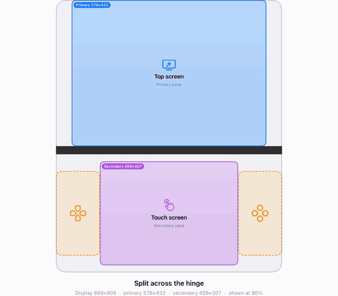
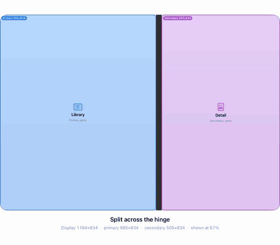
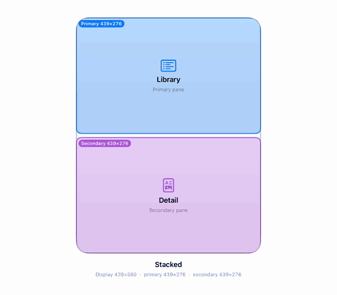

# DualPane

[](https://swiftpackageindex.com/JoryShilmover/DualPane)
[](https://swiftpackageindex.com/JoryShilmover/DualPane)
[](https://github.com/JoryShilmover/DualPane/actions/workflows/ci.yml)
[](https://github.com/JoryShilmover/DualPane/releases)
[](LICENSE)

Lay out two panes on foldable, dual-screen and ordinary displays. DualPane finds the best stacked,
side-by-side or split arrangement around hinges, camera cutouts and safe areas.

<p align="center">
  
</p>

## Why DualPane?

- **Foldables without special cases.** Hand the solver the hinge and any camera cutout, and it keeps both
  panes clear of them, splitting across the fold when each side has room. On iOS 27.1, `DualPaneUIKit`
  reads the fold regions for you.
- **One layout for every shape.** The same call handles portrait, landscape, Split View and resizable
  windows, choosing stacked, side by side or split based on which keeps the smaller pane largest.
- **Fixed-aspect content.** Panes can keep an aspect ratio, such as 4:3 game screens or 16:9 video, and the
  solver can reserve room for on-screen controls beside them.
- **Plain geometry you can test.** `DualPaneCore` takes rectangles and returns rectangles, with no UI
  framework, so layouts can be unit tested. It runs on Apple platforms and Linux.

If you only need to switch between an `HStack` and a `VStack` by width, SwiftUI's `ViewThatFits` or a size
class check is simpler. DualPane is for when the display itself has obstacles or the panes have shapes to
keep.

DualPane was extracted from the screen-layout solver in the Duo DS emulator.

> **Status:** early (0.x). Expect breaking changes before 1.0.

## Modules

| Product | Platforms | What it does |
|---|---|---|
| `DualPaneCore` | Apple platforms, Linux | Platform-independent solver: `DisplayEnvironment` in, `LayoutSolution` out. |
| `DualPaneUIKit` | iOS | Captures a `DisplayEnvironment` from a `UIView`, including iOS 27.1 fold regions and hinge changes. |
| `DualPaneSwiftUI` | iOS, macOS, tvOS, visionOS | `DualPaneLayout`, a SwiftUI `Layout` that places two views. |

## Installation

```swift
dependencies: [
    .package(url: "https://github.com/JoryShilmover/DualPane.git", from: "0.1.1"),
]
```

## Usage

```swift
import DualPaneCore

let display = CGRect(x: 0, y: 0, width: 1000, height: 700)
let hinge = ExclusionRegion(frame: CGRect(x: 490, y: 0, width: 20, height: 700), kind: .division)
let solution = DualPaneSolver.solve(
    environment: DisplayEnvironment(bounds: display, safeBounds: display, exclusionRegions: [hinge]))
// solution.arrangement == .split
// solution.primaryPane == (0, 0, 490, 700), solution.secondaryPane == (510, 0, 490, 700)
```

```swift
import SwiftUI
import DualPaneSwiftUI

DualPaneLayout {
    MapView()
    DetailView()
}
```

### Configuration

`DualPaneConfiguration` controls what the solver optimises for:

| Setting | Default | Meaning |
|---|---|---|
| `primarySizing`, `secondarySizing` | `.fill` | Fill the slot, or `.aspectRatio(r)` for the largest centred rectangle of that ratio. |
| `gutter` | 8 | Space between stacked or side-by-side panes. |
| `measure` | `.shortSide` | How pane size is compared: `.width` or `.shortSide`. |
| `minimumLegibleSize` | 170 | Below this, the solution is compact. |
| `accessories` | `nil` | Two regions (such as on-screen controls) kept clear of the panes, placed in a band below or flanking them. |

`DualPaneConfiguration.ds` is the preset used by the Duo DS emulator: two 4:3 screens with DS-style
thumb-control regions.

Fold regions come from the iOS 27.1 SDK. If you build with an older SDK, `DualPaneUIKit` reports
the safe area only.

## In action

| A hinge moves: panes stay split across it | The display narrows: side by side becomes stacked |
|---|---|
|  |  |

The GIF at the top uses the `.ds` preset. These two use the default configuration.

## Demo app

`Examples/DualPaneDemo` is a small iOS and macOS app for trying the solver. Open
`Examples/DualPaneDemo/DualPaneDemo.xcodeproj` and run the `DualPaneDemo` scheme.

- Pick a display size (Duo, iPhone, iPad) or use Freeform and resize the window.
- Add a hinge or camera housing and drag it around the display.
- Switch between plain panes and the DS preset, and adjust sizing, gutter and legibility.
- On iOS, **Live** lays out the device's real display, including fold regions on iOS 27.1.

To run it on a device, choose your team under Signing & Capabilities. Launch arguments set the
starting state, for example `-display duoInnerLandscape -configuration ds -hinge vertical -camera YES`.

The GIFs in this README are the demo's scripted tours (`-tour fold`, `-tour hinge`, `-tour resize`).
`Examples/DualPaneDemo/record-gifs.sh` records them on an iPad simulator and needs `ffmpeg`.

## License

MIT. See [LICENSE](LICENSE).
